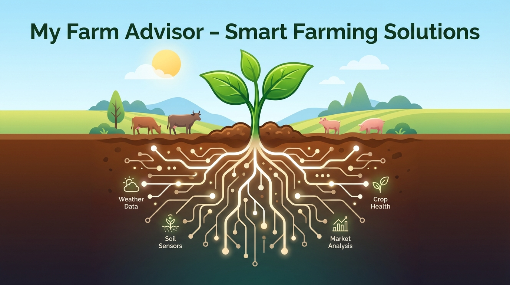

# My Farm Adviser



My Farm Adviser is a farm intelligence and research assistant built on upstream OpenClaw and shaped by the farm-science principles in `SOUL.md` and the operator needs in `USER.md`.

It is designed for farmhands, supervisors, owners, researchers, and ag analysts who need practical field decisions, reproducible analysis, and infrastructure they can actually keep running.

- Evidence-first recommendations instead of dashboard theater
- Field-level data lineage so results can be traced back to methods and inputs
- Docker-first deployment so RAM and compute can scale beyond Cloudflare Worker limits
- Upstream OpenClaw compatibility for easier updates and broader channel/tool support

## What This Repo Is

This repository now tracks real upstream OpenClaw as its runtime base.

- Core runtime, gateway, Docker flow, and channel support come from `openclaw/openclaw`
- Farm-specific behavior lives in `SOUL.md`, `USER.md`, and retained custom skills in `skills/`
- The previous Cloudflare Worker implementation is preserved in `legacy/cloudflare-worker/`

## Who It Is For

My Farm Adviser assumes multiple roles may use the same system:

- Farmhands who need simple instructions for one field today
- Supervisors who need fast rollups across active fields
- Owners and managers who care about profit per acre, risk, and timing
- Researchers who need reproducible methods, versioned data, and audit trails
- Analysts who need outputs that can be checked against real farm data

The guiding rule is simple: one field-level source of truth, many ways to summarize it.

## Farm Skills Included

The active custom layer currently keeps these skills:

- `skills/my-farm-advisor/`
- `skills/my-farm-breeding-trial-management/`
- `skills/my-farm-qtl-analysis/`
- `skills/superior-byte-works-google-timesfm-forecasting/`
- `skills/superior-byte-works-wrighter/`

These sit on top of the upstream OpenClaw skill system rather than replacing it.

## Core Principles

Derived from `SOUL.md` and `USER.md`:

- Prefer measurable outcomes over rhetoric
- Preserve data, methods, and provenance so work stays reproducible
- Keep interfaces direct and practical for busy operators
- Do not silently destroy or overwrite important farm history
- Favor portable, inspectable tooling over vendor lock-in

## Quick Start

Runtime baseline: Node `22+`.

### Docker deployment

This is the default deployment path.

```bash
cp .env.example .env

# set these to real host paths
export OPENCLAW_CONFIG_DIR="$HOME/.openclaw"
export OPENCLAW_WORKSPACE_DIR="$HOME/.openclaw/workspace"

pnpm install
pnpm build

# Build the image locally first, then start with compose
docker build -t openclaw:local -f Dockerfile .
docker compose up -d
```

Open the gateway on the configured port, default `18789`.

Useful follow-up commands:

```bash
docker compose logs -f openclaw-gateway
docker compose exec openclaw-cli node dist/index.js status
```

### From source

```bash
pnpm install
pnpm build
pnpm openclaw onboard --install-daemon
pnpm gateway:watch
```

The CLI command surface remains `openclaw` for upstream compatibility.

## Setup Notes

- Workspace config lives in `~/.openclaw`
- Workspace skills live in `~/.openclaw/workspace/skills`
- This repo also ships bundled farm skills in `skills/`
- `SOUL.md` and `USER.md` provide the farm-specific identity layer for this distribution

If you want the fastest path to a usable farm assistant, start with Docker, then add credentials, channels, and workspace data once the gateway is healthy.

## Deployment Guidance

For production-style deployment elsewhere:

1. Use the upstream Docker path in `Dockerfile` and `docker-compose.yml`
2. Mount persistent config and workspace volumes
3. Keep farm data outside the container image
4. Scale memory and CPU at the container host level instead of fighting worker limits
5. Treat this repo's custom layer as skills + identity + docs, not a forked runtime architecture

## Legacy Cloudflare Worker Build

The old Cloudflare-based implementation is intentionally preserved for reference in:

- `legacy/cloudflare-worker/`

It is no longer the primary deployment target.

## Upstream Relationship

My Farm Adviser tracks upstream OpenClaw closely so the project can keep benefiting from:

- active runtime maintenance
- broader channel support
- upstream Docker improvements
- new tools, skills, and platform integrations

When changing core runtime behavior, prefer upstream-compatible changes whenever possible.

## Helpful Docs

- OpenClaw getting started: `https://docs.openclaw.ai/start/getting-started`
- OpenClaw Docker install: `https://docs.openclaw.ai/install/docker`
- OpenClaw skills docs: `https://docs.openclaw.ai/tools/skills`
- OpenClaw gateway config: `https://docs.openclaw.ai/gateway/configuration`

## Brand Notes

- Product name: My Farm Adviser
- Runtime/CLI base: OpenClaw
- Historical repo naming may still use `my-farm-advisor` in some paths while branding shifts to `adviser`
