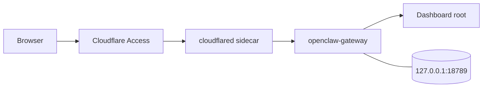
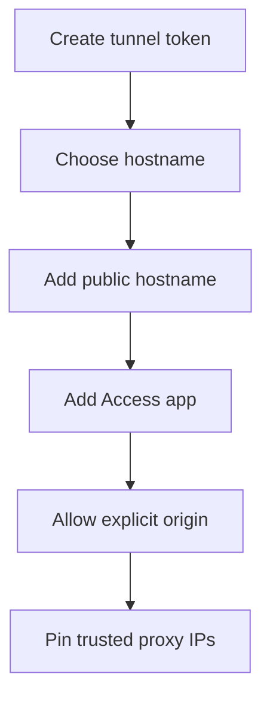
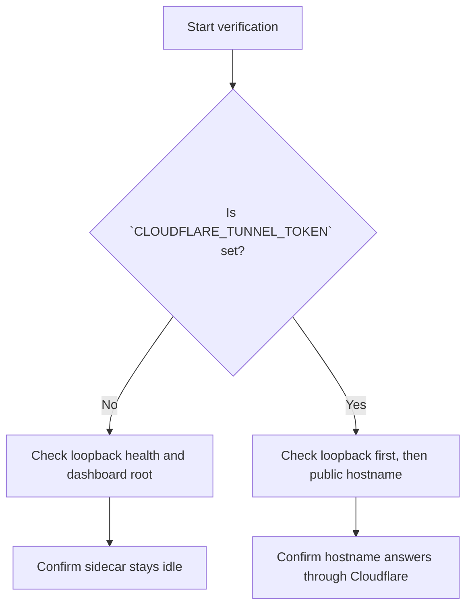

# Cloudflare + Coolify

## Goal

Use this runbook when you want one public app hostname, a private VPS origin, and the supported Coolify deployment contract.

Public admins open `https://<OPENCLAW_PUBLIC_HOSTNAME>/`. Cloudflare Access is the only public login layer, then the same-compose `cloudflared` sidecar forwards trusted-proxy requests to the loopback-only gateway origin.

## What are we doing

You are setting up two layers that work together:

1. Cloudflare publishes and protects the hostname stored in `OPENCLAW_PUBLIC_HOSTNAME`.
2. Coolify runs `docker-compose.coolify.yml`, where `openclaw-gateway` stays private on `127.0.0.1:18789` and `cloudflared` only connects outbound.

Why this matters: people can reach the app through Cloudflare, but the raw VPS service still is not public.

| Topic              | Required value or behavior                                                       | Why it matters                                               |
| ------------------ | -------------------------------------------------------------------------------- | ------------------------------------------------------------ |
| Public hostname    | `OPENCLAW_PUBLIC_HOSTNAME` is the public root hostname placeholder               | This is the browser entry admins type                        |
| Root entry         | `https://<OPENCLAW_PUBLIC_HOSTNAME>/` serves the dashboard and admin UI root     | Public admin traffic starts at the root hostname             |
| Tunnel switch      | `CLOUDFLARE_TUNNEL_TOKEN` is the only supported switch for tunnel mode           | Blank token means no public hostname is published            |
| Origin target      | `CLOUDFLARED_ORIGIN_URL` is automatic from compose, not user-set                 | The sidecar always points at `http://openclaw-gateway:18789` |
| Private origin     | Blank `CLOUDFLARE_TUNNEL_TOKEN` keeps the origin private on `127.0.0.1:18789`    | The app can stay VPS-private with no public exposure         |
| Trusted proxy auth | Cloudflare Access headers are the supported public auth path                     | Public login happens at Cloudflare, not with gateway tokens  |
| Control UI safety  | Control UI still needs explicit `gateway.controlUi.allowedOrigins` and proxy IPs | Tunnel publishing does not replace browser origin policy     |



Caption: Traffic enters through Cloudflare, while the gateway port stays bound to loopback on the VPS.

## Quick path

- In Cloudflare, create a token-based tunnel and copy the token.
- Set `OPENCLAW_PUBLIC_HOSTNAME` to the public hostname you want.
- In the tunnel dashboard, point that hostname to `http://openclaw-gateway:18789`.
- Add a Cloudflare Access self-hosted app for the same hostname.
- Keep the gateway in trusted-proxy mode with explicit `gateway.controlUi.allowedOrigins` and explicit trusted proxy IPs.
- In Coolify, deploy `docker-compose.coolify.yml` with `CLOUDFLARE_TUNNEL_TOKEN`, `OPENCLAW_PUBLIC_HOSTNAME`, and the normal gateway env vars.

## Before you start

- Cloudflare Zero Trust is available for your account.
- The DNS zone for your hostname is already in Cloudflare.
- Coolify can deploy this repo with `docker-compose.coolify.yml`.
- You have a strong `OPENCLAW_GATEWAY_TOKEN` ready.
- You know the hostname you want to publish, for example `my-farm-advisor.superiorbyteworks.com`.
- You are not trying to expose a raw public origin. `OPENCLAW_PUBLIC_HTTP` is not part of the supported contract.

## One-time Cloudflare prep

Do these once in the Cloudflare dashboard before you deploy from Coolify.



Caption: Set up Cloudflare and the gateway in this order so the hostname, Access policy, browser origin, and trusted proxy boundary all match the same deployment.

| Cloudflare or Coolify field | Set it to                            | Notes                                                       |
| --------------------------- | ------------------------------------ | ----------------------------------------------------------- |
| Tunnel connector type       | `token-based`                        | Use the token as `CLOUDFLARE_TUNNEL_TOKEN`                  |
| Public hostname target      | `http://openclaw-gateway:18789`      | Keep the target inside the compose network                  |
| Access application type     | `self-hosted`                        | Protect the hostname stored in `OPENCLAW_PUBLIC_HOSTNAME`   |
| Access login method         | `One-Time PIN`                       | Make sure your policy allows the right users                |
| Allowed origin              | `https://<OPENCLAW_PUBLIC_HOSTNAME>` | Add this exact origin to `gateway.controlUi.allowedOrigins` |
| Trusted proxy IPs           | explicit sidecar IPs only            | Add only the Cloudflare-facing proxy IPs, never wildcards   |

### Step 1: Create the tunnel token

In Cloudflare Zero Trust:

1. Open `Networks`, then `Tunnels`.
2. Create a tunnel for this deployment.
3. Choose the token-based connector flow.
4. Copy the token for Coolify.

Save that value as `CLOUDFLARE_TUNNEL_TOKEN`.

Why this matters: this repo supports the token flow only. Do not switch to a credentials JSON file or a local hostname mapping file.

### Step 2: Choose the public hostname

Set `OPENCLAW_PUBLIC_HOSTNAME` to the hostname users should open in the browser.

Example:

```dotenv
OPENCLAW_PUBLIC_HOSTNAME=my-farm-advisor.superiorbyteworks.com
```

Why this matters: the docs, tunnel hostname, Access app, and dashboard root all need to point at the same public hostname.

### Step 3: Add the public hostname to the tunnel

Inside that tunnel, add a public hostname with these values:

- Hostname: the value of `OPENCLAW_PUBLIC_HOSTNAME`
- Service type: `HTTP`
- Service URL: `http://openclaw-gateway:18789`

Important truth: `CLOUDFLARED_ORIGIN_URL` is automatic from compose. You do not set it yourself. `docker-compose.coolify.yml` injects `CLOUDFLARED_ORIGIN_URL=http://openclaw-gateway:18789` for the sidecar.

Important truth: in token mode, the hostname mapping lives in the Cloudflare dashboard, not in local config files on the VPS.

### Step 4: Add the Cloudflare Access app

Create a self-hosted Access application for the same hostname stored in `OPENCLAW_PUBLIC_HOSTNAME`.

Use these values:

- Domain: the value of `OPENCLAW_PUBLIC_HOSTNAME`
- Path: protect the whole site
- Login method: `One-Time PIN`
- Identity headers: keep Cloudflare Access defaults so the gateway can trust `cf-access-authenticated-user-email` and require `cf-access-jwt-assertion`

Why this matters: the supported public admin path is the dashboard root, and Cloudflare Access is the login gate for every public request.

### Step 5: Allow the public browser origin explicitly

Add the public HTTPS origin to `gateway.controlUi.allowedOrigins`.

Expected value:

- `https://<OPENCLAW_PUBLIC_HOSTNAME>`

Why this matters: trusted-proxy auth does not relax browser origin checks. The public dashboard only works when the exact Cloudflare origin is allowlisted.

Rules for this setting:

- keep the public origin explicit
- keep loopback defaults for local and private flows
- do not use `*`
- do not rely on host-header fallback

### Step 6: Pin the trusted proxy boundary

Set `gateway.trustedProxies` to the explicit IPs that front the gateway in this deployment.

Rules for this setting:

- include the Cloudflare-facing sidecar or proxy IPs only
- do not trust the whole Docker bridge range
- do not leave a direct path to `openclaw-gateway` outside the proxy boundary

Why this matters: trusted-proxy mode is only safe when the gateway accepts forwarded auth headers from explicit proxy IPs and nowhere else.

## Coolify deployment

### Step 1: Deploy the single compose app

In Coolify, deploy this repo with `docker-compose.coolify.yml`.

Do not create a second app for `cloudflared`. The supported contract is one compose deployment with the sidecar already included.

### Step 2: Set the environment values

Use `.env.coolify` as your reference.

Minimum values for the supported Cloudflare path:

```dotenv
OPENCLAW_GATEWAY_TOKEN=<long-random-token>
CLOUDFLARE_TUNNEL_TOKEN=<your-cloudflare-tunnel-token>
OPENCLAW_PUBLIC_HOSTNAME=<your-public-hostname>
TZ=America/Chicago
DATA_MODE=volume
OPENROUTER_API_KEY=<your-key>
NVIDIA_API_KEY=<optional-if-used>
ANTHROPIC_API_KEY=<optional-if-used>
```

Why this matters: `CLOUDFLARE_TUNNEL_TOKEN` turns tunnel mode on, and `OPENCLAW_PUBLIC_HOSTNAME` tells Cloudflare which root hostname should represent this app.

### Step 3: Keep storage persistent

Attach the Coolify persistent volume for `/data`.

Why this matters: gateway state, workspace data, and seeded config survive restarts.

### Step 4: Wait for the first boot

Start the deployment and give it a few minutes. The first boot can take longer because the gateway initializes before the health check settles.

### Step 5: Open the public entry

After the deployment is healthy, Access is ready, `gateway.controlUi.allowedOrigins` includes the public HTTPS origin, and `gateway.trustedProxies` includes only the trusted proxy IPs, open:

`https://<OPENCLAW_PUBLIC_HOSTNAME>`

Cloudflare Access should challenge unauthenticated users, then send approved users to the dashboard and admin UI root at `/`.

## Important truths to keep in mind

- `CLOUDFLARE_TUNNEL_TOKEN` present: `cloudflared` starts and publishes the Cloudflare hostname already mapped in the dashboard.
- `CLOUDFLARE_TUNNEL_TOKEN` blank: the sidecar exits cleanly and the app stays private on `127.0.0.1:18789`.
- `OPENCLAW_PUBLIC_HOSTNAME` is required when `CLOUDFLARE_TUNNEL_TOKEN` is set.
- Browser control stays bound to `127.0.0.1` and is outside the public tunnel path.
- The supported public admin path is the root dashboard URL, not a canvas-first or token-bootstrap flow.
- Control UI is an admin surface. It still needs explicit `gateway.controlUi.allowedOrigins` for any non-loopback browser deployment.
- Cloudflare Access is the only supported public login path for this deployment shape. Do not publish gateway token, password, or pairing bootstrap as the internet-facing admin flow.
- `allowInsecureAuth` is not acceptable public-deployment guidance. It is a localhost compatibility flag, not a safe Cloudflare fix.

## Verification

Use the checks below after Coolify deploys.



Caption: Verification splits into two supported modes, private-origin mode and tunnel-enabled mode.

| Check           | Command or place to look                     | Healthy result                                                             | Meaning                                        |
| --------------- | -------------------------------------------- | -------------------------------------------------------------------------- | ---------------------------------------------- |
| Loopback health | `curl -i http://127.0.0.1:18789/healthz`     | `200 OK`                                                                   | The raw origin is up on the VPS                |
| Loopback root   | `curl -i http://127.0.0.1:18789/`            | auth-required response, not a public success page                          | The dashboard root exists and stays protected  |
| Public hostname | `curl -I https://<OPENCLAW_PUBLIC_HOSTNAME>` | Cloudflare-side response, often Access challenge or authenticated response | The hostname is answering through Cloudflare   |
| Sidecar logs    | Coolify `cloudflared` service logs           | Connected tunnel in token mode, clean idle exit when token is blank        | The sidecar behavior matches the selected mode |

### Mode 1: `CLOUDFLARE_TUNNEL_TOKEN` is blank

Use this mode when you want the stack to stay private on the VPS.

Run:

```bash
curl -i http://127.0.0.1:18789/healthz
curl -i http://127.0.0.1:18789/
```

Expect:

- `/healthz` returns `200 OK`
- `/` returns an auth-required response
- the `cloudflared` container exits cleanly and stays idle

Why this matters: blank-token mode is the expected private-origin path, not a broken deployment.

### Mode 2: `CLOUDFLARE_TUNNEL_TOKEN` is set

Use this mode when Cloudflare should publish the hostname.

First confirm the private origin still works:

```bash
curl -i http://127.0.0.1:18789/healthz
curl -i http://127.0.0.1:18789/
```

Then check the public hostname:

```bash
curl -I https://<OPENCLAW_PUBLIC_HOSTNAME>
```

Expect:

- loopback `/healthz` is `200 OK`
- loopback root stays protected until trusted-proxy headers or local auth apply
- the public hostname answers from Cloudflare instead of timing out at the VPS
- after browser login, Cloudflare Access sends you to the dashboard root and admin UI

Why this matters: the tunnel can only proxy a healthy origin. Check loopback first, then Cloudflare.

## Troubleshooting

### Tunnel token missing or wrong

Symptoms:

- the hostname does not come up through Cloudflare
- the `cloudflared` container exits right away

Check:

- `CLOUDFLARE_TUNNEL_TOKEN` is set in Coolify
- the value is a real tunnel token, not a tunnel ID or unrelated API token
- loopback health still works on `127.0.0.1:18789`

### Hostname mismatch

Symptoms:

- Cloudflare publishes a different hostname
- Access works for one hostname but the browser opens another

Check:

- the tunnel public hostname exactly matches `OPENCLAW_PUBLIC_HOSTNAME`
- the Access app uses the same hostname
- `gateway.controlUi.allowedOrigins` includes `https://<OPENCLAW_PUBLIC_HOSTNAME>` exactly
- the tunnel service URL still targets `http://openclaw-gateway:18789`

### Access is missing or incomplete

Symptoms:

- the hostname is reachable without an Access login
- you see routing errors or an unexpected auth path

Check:

- a self-hosted Access app exists for `OPENCLAW_PUBLIC_HOSTNAME`
- `One-Time PIN` is enabled
- the policy allows your test user
- the gateway is configured for trusted-proxy auth with the expected Cloudflare Access headers
- `curl -I https://<OPENCLAW_PUBLIC_HOSTNAME>` reaches Cloudflare instead of hanging

### Control UI assumptions

Symptoms:

- you expect the tunnel to make Control UI public-safe by itself
- you are considering `allowInsecureAuth` as the fix

Check:

- non-loopback Control UI deployments still need explicit `gateway.controlUi.allowedOrigins`
- `gateway.controlUi.allowedOrigins` must list the exact public HTTPS origin, not `*`
- trusted-proxy mode still requires explicit `gateway.trustedProxies`
- Cloudflare Tunnel does not replace browser origin policy
- `allowInsecureAuth` is not acceptable guidance for public deployment

## Plain-language contract

- Supported compose file: `docker-compose.coolify.yml`
- Supported public entry: `https://<OPENCLAW_PUBLIC_HOSTNAME>`
- Supported admin UI path: dashboard root at `/`
- Required public auth layer: Cloudflare Access only
- Required browser allowlist: exact `https://<OPENCLAW_PUBLIC_HOSTNAME>` in `gateway.controlUi.allowedOrigins`
- Required trusted boundary: explicit `gateway.trustedProxies`, no wildcard trust
- Supported tunnel switch: `CLOUDFLARE_TUNNEL_TOKEN`
- Automatic sidecar origin: `CLOUDFLARED_ORIGIN_URL=http://openclaw-gateway:18789`
- Blank token behavior: keep the origin private on `127.0.0.1:18789`
- Browser control stance: private by default, not covered by tunnel safety claims
