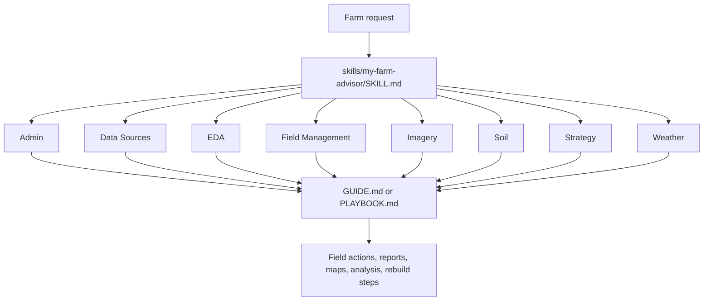
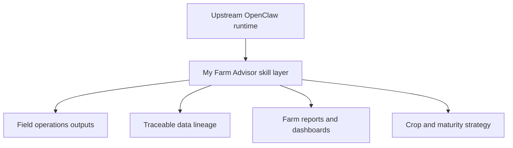

# My Farm Advisor

My Farm Advisor is the farm-specific skill umbrella for this repository. It turns the upstream OpenClaw runtime into an evidence-first agricultural system that can rebuild farm data, analyze field conditions, generate operator-ready reports, and route day-to-day questions into the right agronomic workflow.

Use this skill when the request is fundamentally about fields, crops, weather, soil, imagery, reporting, or strategy. It is the top-level router for the farm domain in this repo.

## What This Skill Does

- Routes farm questions into the right operational subtree instead of dumping everything into one giant prompt.
- Connects field operations, data rebuilds, imagery, soil, weather, and strategy work into one coherent system.
- Preserves a field-level source of truth so summaries and recommendations stay traceable.
- Provides both quick guidance docs and deeper playbooks for repeatable farm workflows.
- Anchors the farm-specific skill layer that sits on top of upstream OpenClaw.

## How It Runs

The umbrella entrypoint is [`SKILL.md`](SKILL.md). From there, the skill routes into one of the subtree indexes, and then into the actual guide or playbook that does the work.

## Core Capability Areas

| Area             | What it covers                                                         | Start here                                               |
| ---------------- | ---------------------------------------------------------------------- | -------------------------------------------------------- |
| Admin            | Geospatial administration and interactive map workflows                | [`admin/INDEX.md`](admin/INDEX.md)                       |
| Data Sources     | Canonical rebuilds, seed pipelines, and farm intelligence reporting    | [`data-sources/INDEX.md`](data-sources/INDEX.md)         |
| EDA              | Exploratory analysis, comparisons, correlations, and time-series views | [`eda/INDEX.md`](eda/INDEX.md)                           |
| Field Management | Boundaries, field sampling, and headlands workflows                    | [`field-management/INDEX.md`](field-management/INDEX.md) |
| Imagery          | Landsat and Sentinel-2 workflows for vegetation and scene analysis     | [`imagery/INDEX.md`](imagery/INDEX.md)                   |
| Soil             | SSURGO, poster-card outputs, and CDL-based soil/crop context           | [`soil/INDEX.md`](soil/INDEX.md)                         |
| Strategy         | Crop strategy and maturity planning workflows                          | [`strategy/INDEX.md`](strategy/INDEX.md)                 |
| Weather          | NASA POWER weather ingestion and downstream weather analysis           | [`weather/INDEX.md`](weather/INDEX.md)                   |

## Typical Workflow

Examples:

- "Rebuild the farm from source systems" -> [`data-sources/farm-data-rebuild/PLAYBOOK.md`](data-sources/farm-data-rebuild/PLAYBOOK.md)
- "Generate field boundaries or map views" -> [`field-management/field-boundaries/GUIDE.md`](field-management/field-boundaries/GUIDE.md)
- "Check weather and maturity planning" -> [`weather/INDEX.md`](weather/INDEX.md) and [`strategy/INDEX.md`](strategy/INDEX.md)
- "Prepare a farm intelligence report" -> [`data-sources/farm-intelligence-reporting/PLAYBOOK.md`](data-sources/farm-intelligence-reporting/PLAYBOOK.md)

## Why It Matters In This Repo

This skill is the main farm-specific intelligence layer. The rest of the repository gives you runtime, channels, gateway behavior, and deployment. This skill tells the system how to think and work like a farm advisor.

## Important Entry Points

- Umbrella router: [`SKILL.md`](SKILL.md)
- Top-level navigation: [`INDEX.md`](INDEX.md)
- Farm data rebuild: [`data-sources/farm-data-rebuild/PLAYBOOK.md`](data-sources/farm-data-rebuild/PLAYBOOK.md)
- Farm reporting: [`data-sources/farm-intelligence-reporting/PLAYBOOK.md`](data-sources/farm-intelligence-reporting/PLAYBOOK.md)
- Field boundaries: [`field-management/field-boundaries/GUIDE.md`](field-management/field-boundaries/GUIDE.md)
- SSURGO workflows: [`soil/ssurgo-soil/GUIDE.md`](soil/ssurgo-soil/GUIDE.md)
- Sentinel-2 workflows: [`imagery/sentinel2-imagery/GUIDE.md`](imagery/sentinel2-imagery/GUIDE.md)
- Weather workflows: [`weather/nasa-power-weather/GUIDE.md`](weather/nasa-power-weather/GUIDE.md)

## Data and Runtime Notes

- This skill suite ships large supporting examples and shared data assets.
- Some workflows assume pulled large files or generated artifacts are available locally.
- The nested subtree documents are the real operating surface; this README is the map, not the full manual.

## Quick Start

1. Start with [`SKILL.md`](SKILL.md).
2. Open the matching area in [`INDEX.md`](INDEX.md).
3. Follow the linked `GUIDE.md` or `PLAYBOOK.md`.
4. Keep outputs tied back to fields, source data, and reproducible methods.
