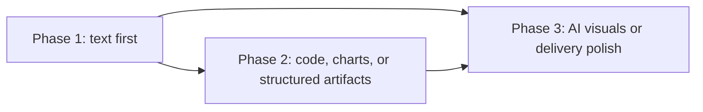
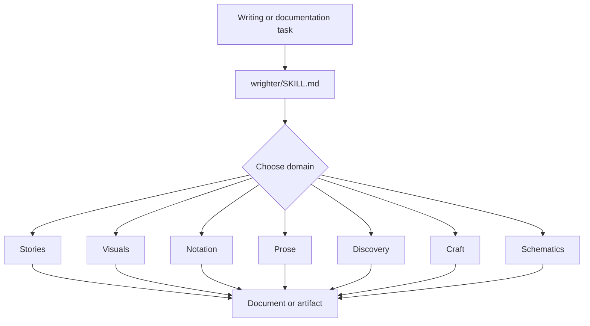
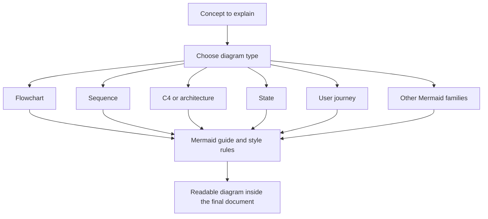
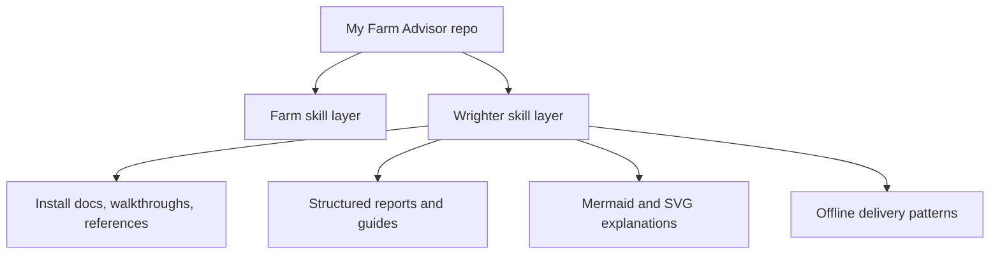

# Superior Byte Works Wrighter

Superior Byte Works Wrighter is the repository's structured writing system. It is the skill pack that turns raw ideas, research, diagrams, and delivery targets into usable artifacts: technical documents, guides, reports, visual explainers, offline deliverables, and domain-specific writing workflows.

If `my-farm-advisor` is the farm brain, `wrighter` is the documentation and publishing engine that explains what the system does, how it works, and how to hand it off clearly.

## What Wrighter Does

- Provides a text-first writing workflow so documentation exists before implementation polish.
- Organizes writing into reusable domains: stories, visuals, notation, prose, discovery, craft, and schematics.
- Supplies Mermaid-heavy visual guidance, SVG patterns, and delivery packaging for offline or portable outputs.
- Supports research intake and synthesis before drafting so documents start from evidence rather than vibes.
- Gives this repo a reusable way to build serious documentation instead of one-off markdown files.

## The Wrighter Model

Wrighter is opinionated about order:

1. Write the thing clearly.
2. Add structure, code, charts, or validation if needed.
3. Add richer visuals or delivery packaging only after the text is solid.

That is why the core skill is useful in this repo: it keeps operational docs, walkthroughs, reports, and references readable before they become fancy.

## How It Is Organized

| Area       | Purpose                                                      | Start here                                            |
| ---------- | ------------------------------------------------------------ | ----------------------------------------------------- |
| Core       | Principles, workflow, and system model                       | [`core/index.md`](core/index.md)                      |
| Stories    | Long-form documents, references, and template-driven writing | [`stories/INDEX.md`](stories/INDEX.md)                |
| Visuals    | Mermaid, SVG, MIDI, and diagram-authoring guidance           | [`visuals/INDEX.md`](visuals/INDEX.md)                |
| Notation   | Math, theorem, and precision-oriented writing support        | [`notation/INDEX.md`](notation/INDEX.md)              |
| Prose      | Style, structure, and domain writing patterns                | [`prose/INDEX.md`](prose/INDEX.md)                    |
| Discovery  | Research, synthesis, citation, and review intake             | [`discovery/INDEX.md`](discovery/INDEX.md)            |
| Craft      | Validation and quality-control helpers                       | [`craft/INDEX.md`](craft/INDEX.md)                    |
| Schematics | AI-assisted visual generation guidance                       | [`schematics/INDEX.md`](schematics/INDEX.md)          |
| Delivery   | Offline HTML and delivery packaging patterns                 | `delivery/` guides linked from [`SKILL.md`](SKILL.md) |

## How Requests Flow Through Wrighter

This means Wrighter is not one narrow README-writing tool. It is a layered documentation system with routing, standards, and downstream artifact support.

## Mermaid and Visual Workflow

Wrighter has a strong visual-authoring layer, especially for Mermaid.

Key visual entry points:

- Mermaid guide: [`visuals/mermaid/GUIDE.md`](visuals/mermaid/GUIDE.md)
- Mermaid style rules: [`visuals/mermaid/style-guide.md`](visuals/mermaid/style-guide.md)
- SVG guide: [`visuals/svg/GUIDE.md`](visuals/svg/GUIDE.md)
- Visual domain overview: [`visuals/INDEX.md`](visuals/INDEX.md)

## Discovery and Research Workflow

This is one of the most important parts of Wrighter for this repo. It gives the project a repeatable way to move from research to clear documentation instead of skipping straight to prose.

Useful discovery entry points:

- [`discovery/INDEX.md`](discovery/INDEX.md)
- [`discovery/GUIDE.md`](discovery/GUIDE.md)
- [`discovery/search-strategy.md`](discovery/search-strategy.md)
- [`discovery/citation-management.md`](discovery/citation-management.md)

## Delivery Modes

Wrighter also includes delivery-oriented patterns for packaging content once it is written.

- offline open HTML delivery
- sealed or fingerprinted HTML delivery
- shared delivery asset and snapshot models

Those modes are described from the root skill entrypoint in [`SKILL.md`](SKILL.md), because delivery is a downstream concern after the content itself is correct.

## Why It Matters In This Repo

Wrighter is how this repo explains itself. It is the reason the Cloudflare walkthrough, install docs, skill documentation, and future operator handoffs can be treated as durable assets instead of temporary notes.

## Start Here

- Root skill definition: [`SKILL.md`](SKILL.md)
- Core workflow: [`core/index.md`](core/index.md)
- Visuals overview: [`visuals/INDEX.md`](visuals/INDEX.md)
- Discovery overview: [`discovery/INDEX.md`](discovery/INDEX.md)
- Shared conventions: [`_shared/conventions.md`](_shared/conventions.md)
- Provenance: [`provenance.md`](provenance.md)

## Practical Use In This Repo

Use Wrighter when you need to:

- write or improve installation docs
- produce walkthroughs or operating guides
- add Mermaid diagrams to explain systems clearly
- turn research into structured reports
- package documentation for offline or deliverable-ready use
- keep writing consistent across many domains without losing rigor
