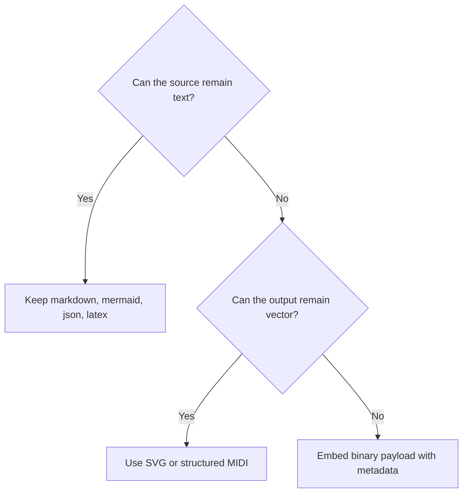

# Delivery Asset Model

The delivery layer is vector-first. It packages source-like assets whenever possible and falls back to binary payloads only when raw signal must be preserved.

## 🧱 Asset Classes

| Class  | Examples                                                    | Default priority | Notes                                            |
| ------ | ----------------------------------------------------------- | ---------------- | ------------------------------------------------ |
| Text   | Markdown, HTML fragments, Mermaid source, LaTeX, JSON state | Highest          | Canonical and diffable                           |
| Vector | SVG, Mermaid rendered to SVG, structured MIDI event views   | High             | Preferred presentation assets                    |
| State  | App-state, delivery manifests, principal scopes, snapshots  | High             | Powers restore and interactivity                 |
| Binary | PDF, PNG, JPG, audio, video, arbitrary attachments          | Fallback         | Use only when vector/text cannot preserve intent |

## 📦 Asset Record

Each packaged asset should have a stable record:

```yaml
asset_id: string
asset_type: markdown | html | mermaid | svg | midi | state | binary
source_kind: text | vector | state | binary
integrity_hash: sha256:...
lineage_ref: string
fingerprint_carrier: true | false
```

## 🧭 Packaging Rules

1. Preserve text and vector sources whenever practical.
2. Pre-render Mermaid to inline SVG for offline delivery when runtime rendering is not needed.
3. Keep app-state structured and serializable.
4. Wrap binary assets with metadata, integrity hashes, and lineage references.
5. In sealed mode, distribute fingerprint carriers across multiple asset classes.

## 🔀 Vector-First Decision Guide



## 🔗 See Also

- [snapshot-model.md](snapshot-model.md)
- [fingerprinting.md](fingerprinting.md)
- [threat-model.md](threat-model.md)
